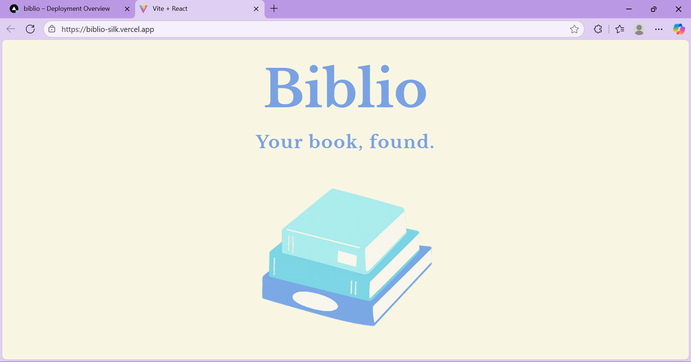
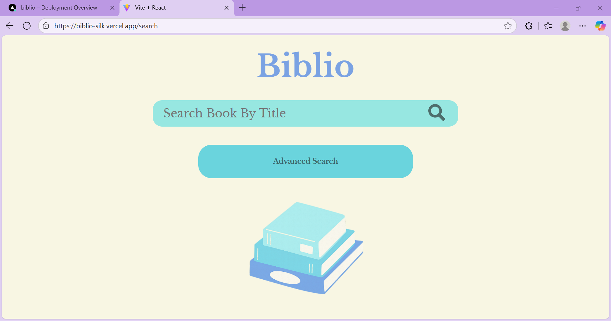
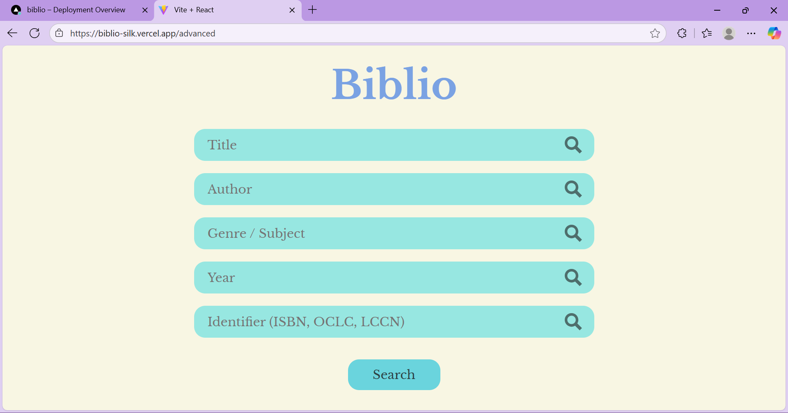
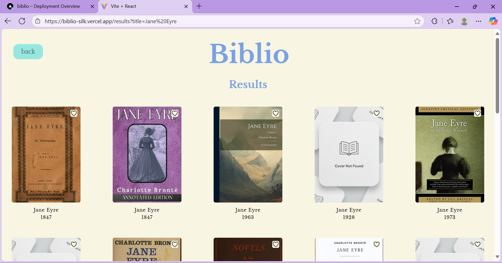
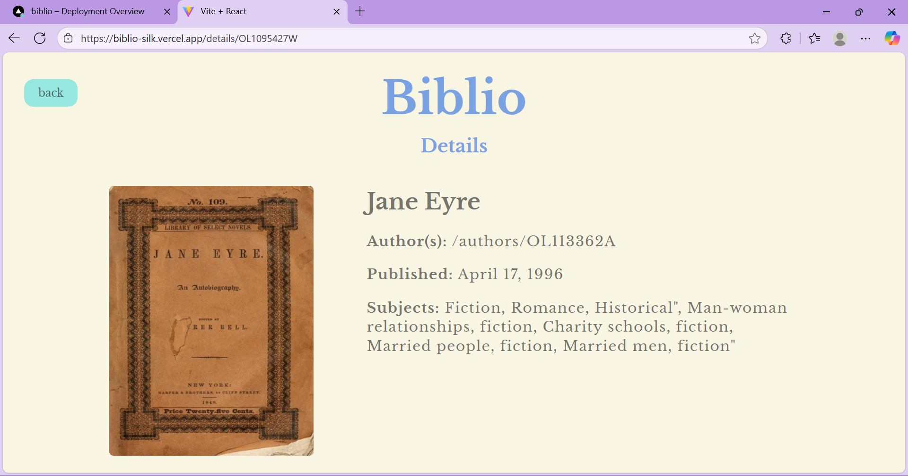
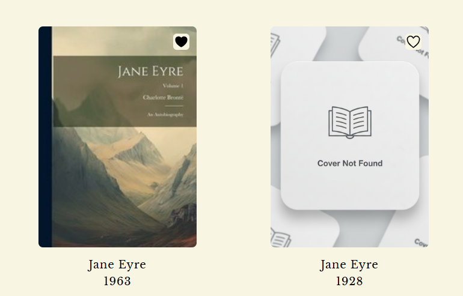
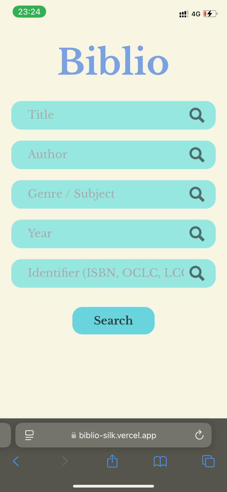

# 📚 Biblio 
## Your book, found.
#### Biblio is a simple, elegant and fun book search web app built with React + Vite.
#### It connects to the Open Library API to let you searcf for books by title, author, genre/subject, year or identifier! ✨Bonus : You can even add books to your favorites with a 🤍 button

## 🚀 Features
* 🔍 Basic Search – Search books by title in one click.
* 🧑‍🔬 Advanced Search – Search by author, genre/subject, year, or identifiers.
*	📖 Book Details – View detailed info about a book including cover, title, authors, subjects, and more.
* ❤ Favourites – Save books to your personal favourites list (saved in localStorage).
* 🎨 Responsive Design – Optimized for desktop 💻 and mobile 📱.

* ⚡ Smooth UI – Clean, minimalist interface with custom CSS styling.

## 🛠 Tech Stack
* React (with Vite for fast dev experience)
*	React Router (page navigation)
*	Open Library API (book data)
*	CSS (custom styling, fully responsive)

## 📸 Screenshots
* 🔦 Splash Page, with the logo of my web app
  
  

* 🔍 Search Page
 
  

* 👩‍💻 Advanced Search Page

  

* 📝 Results

  

* 📖 Book Details

  

* ❤ Favourites
 ##### And Common image to deal with when no book covers fetched from API to maintain web design's consistency.

  

* 📱 Responsive Design

  

  

  

## 🔩 Installation & Setup
#### Clone the repository and install dependencies: 
git clone https://github.com/nimishaaaaaw/biblio.git
cd biblio
npm install
#### Run in development mode: 
npm run dev
#### Build for production:
npm run build
#### Preview production build:
npm run preview

## 🌍 Deployment
### This app is deployed with Vercel at: 👉 https://biblio-silk.vercel.app
### Try it yourself at : 👉 https://codesandbox.io/p/github/nimishaaaaaw/biblio/master

## 👩‍💻 Author
### Made with 💙 by Nimisha Majgawali

### *"Biblio — from the Greek word biblíon (book). Because nothing says ‘bookworm paradise’ quite like a name that literally means books!"*

## 📜 License

#### This project is licensed under the MIT License.
#### See the LICENSE file for details.

